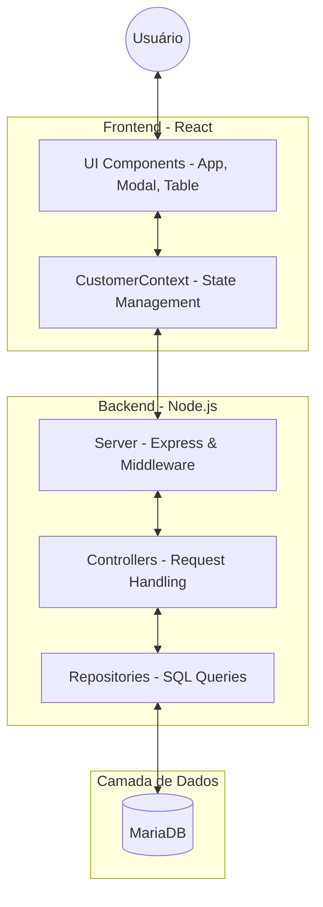

# 🔄 Fluxo e Arquitetura do Projeto

Este documento detalha o funcionamento interno do sistema através de diagramas visuais, cobrindo a inicialização, a jornada do dado e a arquitetura lógica.

## 🏗️ 1. Ordem de Inicialização (Bootstrapping)

Este fluxograma descreve a ordem em que os serviços e scripts são carregados para colocar a aplicação no ar.

```
graph TD
    subgraph Backend_NodeJS
        B1[server.ts: Entrada] --> B2[initDb.ts: Initialize]
        B2 --> B3[db.ts: MariaDB Pool]
        B3 --> B4[SQL: Create Table IF NOT EXISTS]
        B4 --> B5[Express: Register Routes]
        B5 --> B6[Server Listen: Port 3333]
    end

    subgraph Frontend_React
        F1[index.html] --> F2[main.tsx: Render]
        F2 --> F3[ThemeProvider & GlobalStyle]
        F3 --> F4[CustomerProvider: Context]
        F4 --> F5[useEffect: loadCustomers]
        F5 --> F6[App.tsx: Render UI]
    end

    B6 -.->|API Response| F5
```

## 👤 2. Fluxo de Cadastro de Cliente

O diagrama de sequência abaixo mostra o caminho de uma informação desde a interface do usuário até o disco rígido do servidor.

```
sequenceDiagram
    participant U as Usuário
    participant F as Frontend (Modal)
    participant V as ViaCEP (External API)
    participant C as CustomerContext
    participant B as Backend (Express)
    participant R as Repository (SQL)
    participant D as MariaDB

    U->>F: Clica em "Novo Registro"
    U->>F: Digita o CEP
    F->>V: GET /ws/{cep}/json
    V-->>F: Retorna Endereço/Cidade
    F-->>U: Preenche campos automaticamente
    U->>F: Clica em Salvar (Submit)
    F->>C: addCustomer(data)
    C->>B: POST /customers
    B->>R: create(customerData)
    R->>D: INSERT INTO customer...
    D-->>R: Success (insertId)
    R-->>B: Customer Object
    B-->>C: Status 201 (Created)
    C->>B: GET /customers (Refresh List)
    B-->>C: Updated List
    C-->>F: Update Local State
    F-->>U: Fecha Modal e Atualiza Tabela
```

## 🛠️ 3. Diagrama Lógico de Camadas

Uma visão de como o projeto está organizado estruturalmente, respeitando as responsabilidades de cada camada.



## 🔍 4. Ordem de Leitura Recomendada

Para compreender a implementação técnica, siga este fluxo de arquivos:

1. **`backend/src/domain/entities/Customer.ts`**: O contrato do dado.
    
2. **`backend/src/server.ts`**: A espinha dorsal do servidor.
    
3. **`backend/src/repositories/CustomerRepository.ts`**: Onde a mágica do SQL acontece.
    
4. **`frontend/src/contexts/CustomerContext.tsx`**: A ponte entre o visual e os dados.
    
5. **`frontend/src/App.tsx`**: Onde o usuário interage com o sistema.